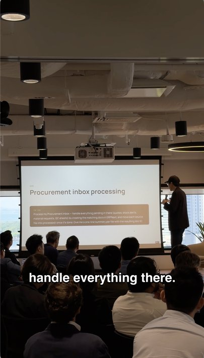

# Talking Head Video Edit

CLI toolkit for two kinds of talking-head videos:

| Type | What it looks like | Typical use |
|------|--------------------|-------------|
| **Social reels** | Vertical talking head + captions (+ title card) | IG / TikTok / Shorts |
| **Demo videos** | Screen recording + talking head — **horizontal or vertical** | Product walkthroughs |

---

## Type 1 — Social reels

Pace-clean a stage or webcam take, burn captions, optional title card for 9:16.

<p align="center">
  
</p>

*Conference talking-head cut — transcribed, trimmed, captions burned in.*

<p align="center">
  
  
</p>

*Left: 2.8s black title card. Right: Manrope SemiBold ASS captions (soft shadow).*
### How to make one

```bash
# 1. Install
brew install ffmpeg
pip install -r requirements.txt
cp .env.example .env   # add free GROQ_API_KEY from https://console.groq.com

# 2. Drop clips
mkdir -p edit/sources
cp /path/to/your_clips/*.mov edit/sources/

# 3. Plan → approve → sample → batch
python scripts/pipeline.py plan
cp edit/director/decisions.example.json edit/director/decisions.json
# edit decisions.json (delivery, sample stem, approvals)
python scripts/director.py apply && python scripts/director.py validate
python scripts/pipeline.py sample YOUR_STEM
python scripts/pipeline.py batch
# optional chapters:
python scripts/pipeline.py stitch
```

Flow: `plan → discuss → decisions.json → sample → approve captions → batch → [stitch]`

More: [DIRECTOR.md](./DIRECTOR.md) · social ASS / title card / QC in [WORKFLOW.md](./WORKFLOW.md)

---

## Type 2 — Demo videos

Same two inputs for both formats:

| Input | Role |
|-------|------|
| `--demo` | Screen recording / paced product demo |
| `--head` | Webcam / talking-head take (VO source by default) |

Pick the layout that matches the platform:

| Option | Layout | Platforms | Helper |
|--------|--------|-----------|--------|
| **Horizontal** | Demo full-bleed + rounded talking-head **PiP** (bottom-right) | X / LinkedIn / YouTube | `helpers/compose_pip.py` |
| **Vertical** | Demo **on top** + talking head **below** (9:16 split) | IG / TikTok / YouTube Shorts | `helpers/compose_split.py` |

### What the output looks like

**Horizontal — X / LinkedIn / YouTube** (16:9 PiP)

<p align="center">
  
</p>

*Rounded talking-head overlay stays bottom-right while the screen demo leads.*

**Vertical — IG / TikTok / YouTube Shorts** (9:16 split)

<p align="center">
  
</p>

*Demo on top, talking head on bottom. Thin black pads top/bottom are part of the CapCut-matched layout.*

### How to make a horizontal demo

```bash
brew install ffmpeg && pip install -r requirements.txt

# Still-check layout first
python helpers/compose_pip.py still --preset capcut_0716 \
  --demo /path/to/demo.mov \
  --head /path/to/head.mov \
  --t 5 \
  -o edit/verify/pip_5s.png

# Render
python helpers/compose_pip.py render --preset capcut_0716 \
  --demo /path/to/demo.mov \
  --head /path/to/head.mov \
  --audio head \
  -o edit/output/pip.mp4
```

Preset `capcut_0716`: face-crop → scale ≈ 0.32 → rounded mask → bottom-right. Params in `config/defaults.json` → `pip`.

### How to make a vertical demo

```bash
# Still-check layout first
python helpers/compose_split.py still --preset capcut_0716_vertical \
  --demo /path/to/demo.mov \
  --head /path/to/head.mov \
  --t 5 \
  -o edit/verify/split_5s.jpg

# Render
python helpers/compose_split.py render --preset capcut_0716_vertical \
  --demo /path/to/demo.mov \
  --head /path/to/head.mov \
  --audio head \
  -o edit/output/vertical.mp4
```

Preset `capcut_0716_vertical`: 2160×3840 padded split (demo band taller than head). Params in `config/defaults.json` → `split`.

### Shared flags

| Flag | Default | Meaning |
|------|---------|---------|
| `--audio` | `head` | `head` · `demo` · `both` · `none` |
| `--duration` | auto | Cap length (seconds) |
| `--head-offset` / `--demo-offset` | `0` | Start each clip later |

```bash
python helpers/compose_pip.py geometry --preset capcut_0716 --canvas 3840x2160
python helpers/compose_split.py geometry --preset capcut_0716_vertical
```

---

## Install (both types)

```bash
git clone https://github.com/wyuee912-ops/video-editing.git
cd video-editing
brew install ffmpeg
pip install -r requirements.txt
```

| | Social reels | Demo videos |
|--|:--:|:--:|
| `ffmpeg` | ✅ | ✅ |
| `pillow` + `requests` | ✅ | ✅ (`pillow` only strictly needed) |
| `GROQ_API_KEY` | ✅ free | — |

---

## Project structure

```
video-editing/
├── helpers/compose_pip.py   # demo — horizontal PiP (16:9)
├── helpers/compose_split.py # demo — vertical split (9:16)
├── scripts/pipeline.py      # social reels — plan / sample / batch / stitch
├── scripts/director.py      # inventory, brief, approval gates
├── config/defaults.json     # captions, title card, pip + split presets
├── edit/sources/            # drop raw clips
├── edit/output/             # renders
├── edit/verify/             # stills for layout / QC
├── fonts/                   # Manrope for captions
├── docs/                    # README screenshots
├── DIRECTOR.md
├── WORKFLOW.md
└── SKILL.md
```

---

## QC before you ship

Pull frames from the **rendered** file (not the source):

| Cut boundary | Caption check |
|---|---|
|  |  |

Checklist: [WORKFLOW.md §13](WORKFLOW.md#13-quality-check-self-eval).

---

## License

MIT
