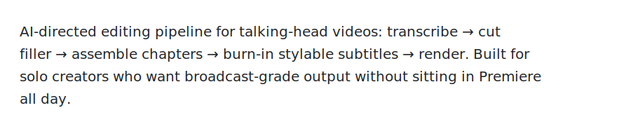

# Talking Head Video Edit

<p align="left"></p>


*Live demo at a Singapore conference — Sai processing a procurement inbox on stage. The pipeline transcribes the talk audio and renders a final cut with subtitle styling you control via prompt.*

---

## What's new (2026-07)

### Social ASS captions + title card

Vertical 9:16 social cuts now have an approved look separate from the stage `manrope-speech` style: native **ASS** captions (Manrope SemiBold, soft shadow, ~3-word cues), burn **before** 1.2× speed, plus an optional **2.8s** black title card.

| Title card | Caption burn-in |
|---|---|
|  |  |

*Left: 2.8s title card (`SafeGround: know when / to trust the click`). Right: ASS cue at PlayRes size 160/180 — white Manrope, outline 0, soft shadow, bottom-center.*

Defaults live in `config/defaults.json` (`caption_ass_social`, `title_card`). Full spec: [WORKFLOW.md §11](WORKFLOW.md#11-social-ass-style--title-card-approved-2026-07).

| | Stage (`manrope-speech`) | Social ASS |
|--|--|--|
| Engine | SRT + `force_style` | Native `.ass` PlayRes |
| Font | Manrope 12 | Manrope SemiBold **160** / **180** (4K) |
| Look | outline 1, no shadow | outline 0, shadow 6–7 |
| Chunking | ~4 words | ~3 words, ≤24 chars |
| Speed | 1.0× | burn @1× → content **1.2×** → title @1.0× |

### Transcript → edit (edit the words, not the timeline)

Instead of scrubbing a NLE, you edit a **markdown transcript**. Deletions become cut windows; wording fixes become caption typefixes. Rebuild EDL → ASS → preview from that file.

```
full_transcript.md  →  user DELETE / FIX  →  full_transcript_edited.md
        ↓                                            ↓
   word timestamps                          EDL keep windows + caption map
        ↓                                            ↓
   pace-clean (optional)  →  burn ASS  →  1.2×  →  title  →  QC frames
```

| Edit in the transcript | Effect on the cut |
|--|--|
| Remove a paragraph / mark `DELETE` | Drop those source ranges from the EDL |
| Change a wrong ASR word (`GUI-Browing` → `GUI-grounding`) | Caption shows the fix; audio stays as spoken |
| Keep chronological blocks | Order never reshuffles — pacing cleanup only |

Artifacts to keep per edit: `full_transcript.md`, `full_transcript_edited.md`, `kept_transcript.md`, `captions_cues.md`, `edl.json`. Details: [WORKFLOW.md §12](WORKFLOW.md#12-transcript--edit-loop).

### Quality check before handoff

Never show a preview until **self-eval** passes. Pull frames from the **rendered output** (not the source) into `verify/`:

| Cut boundary | Caption spot-check |
|---|---|
|  |  |

*Left: inspect cut ±1.5s for mid-word chops / jump cuts. Right: confirm ASS wording and readability (e.g. `GUI-grounding` typefix).*

Checklist (cap 3 fix→re-render loops, then flag leftovers):

1. **Orientation** — upright (phone rotation applied)
2. **Cuts** — no mid-word audio; no black flash; fades OK
3. **Captions** — one cue at a time; readable; typefixes applied; no overlap
4. **Title** — correct copy, ~2.8s, hard cut into content
5. **Duration** — `ffprobe` matches EDL (+ title) after 1.2×
6. **Bookends** — first 2s / last 2s / 2–3 midpoints look coherent

Full checklist: [WORKFLOW.md §13](WORKFLOW.md#13-quality-check-self-eval).

---

## What it does

1. **Transcribes** raw `.mov`/`.mp4` clips with word-level timestamps
2. **Plans cuts** via an LLM "director" — or via a **transcript edit** (DELETE / FIX → EDL)
3. **Assembles** paced edits (pause/filler trim, chronological, micro-fades)
4. **Burns in subtitles** — stage SRT *or* social ASS (Manrope, soft shadow)
5. **Self-evals** cut/caption/title frames in `verify/` before handoff
6. **Renders** the final `.mp4` (optional title card + content speed)

The whole thing runs as a CLI pipeline — drop clips in `edit/sources/`, run `scripts/pipeline.py`, get a finished video.

---

## The Director role 🎬

The director is an LLM agent (Claude, GPT, etc.) that reads your transcript and produces an **Editing Decision List (EDL)** — a JSON spec saying "keep 0:03–0:12, kill 0:13–0:18 (false start), keep 0:19–0:45 but trim breath at 0:31, …"

You don't manually scrub the timeline. You give the director a prompt describing the cut you want, and it makes the calls. Examples:

```bash
python scripts/director.py --clip raw_take_1.mov \
  --prompt "Tight 30-second cut for IG Reels. Remove every 'um', false start, and any time I trail off. Keep the punchline at the end intact."
```

The director outputs an EDL the pipeline consumes. You can edit the EDL by hand before rendering if you want surgical control — it's just JSON.

### Common director prompts

| Use case | Prompt |
|---|---|
| **Tight reel** | "Cut to 30s max. Remove fillers, breaths, false starts. Keep the hook in the first 3 seconds." |
| **Tutorial** | "Keep all instructional content. Trim only dead air >0.8s and obvious flubs. Preserve natural pacing." |
| **Podcast clip** | "Extract the strongest 60s standalone moment. Must have a hook + payoff. No mid-thought cuts." |
| **B-roll candidates** | "Mark segments where I look away or pause >1.5s — those are b-roll insertion points." |
| **Bilingual cut** | "Keep both English and Chinese sections. Tag each segment with language for subtitle styling." |
| **Chapter split** | "Identify 3-5 natural chapter breaks. Output an EDL per chapter so I can render them as standalone clips." |

---

## Subtitle styling — the fun part

### Stage style (SRT)

Subtitles are burned in via ffmpeg's `drawtext`/`subtitles` filters, configured per-segment in the EDL. You can override globally via flags or per-segment in the JSON.

### Text color
```bash
--font-color "#FFFFFF"        # hex
--font-color "yellow"         # named
--font-color "auto"           # pipeline picks high-contrast vs background
```

### Outline (border around text — keeps it readable on busy backgrounds)
```bash
--outline-color "#000000"
--outline-width 3             # px
```

### Shadow (drop shadow for depth)
```bash
--shadow-color "#000000@0.6"  # color + alpha
--shadow-x 2 --shadow-y 2     # offset in px
```

### Combine them
```bash
python scripts/pipeline.py --clip raw_take_1.mov \
  --font "Helvetica Bold" --font-size 56 \
  --font-color "#FFD400" \
  --outline-color "#000" --outline-width 4 \
  --shadow-color "#000@0.7" --shadow-x 3 --shadow-y 3
```

### Per-segment overrides (in the EDL JSON)
```json
{
  "segments": [
    {
      "start": 0.0, "end": 3.2,
      "subtitle_style": {
        "font_color": "#FF4444",
        "outline_color": "#000",
        "outline_width": 5
      }
    },
    {
      "start": 3.2, "end": 8.5,
      "subtitle_style": { "font_color": "auto" }
    }
  ]
}
```

Use this to make the **hook** in your first segment pop with a bright color + heavy outline, then drop back to clean white for the body.

### Social style (ASS)

For vertical reels, burn a PlayRes-matched `.ass` file (not SRT `force_style`) so font size is real pixels:

```bash
ffmpeg -i base.mp4 -vf "ass=captions.ass:fontsdir=fonts" -c:a copy captioned.mp4
# then speed content only:
ffmpeg -i captioned.mp4 -filter:v "setpts=PTS/1.2" -filter:a "atempo=1.2" sped.mp4
```

Key ASS style fields (preview 1920×3414): `Fontname=Manrope SemiBold`, `Fontsize=160`, `Outline=0`, `Shadow=6`, `BackColour=&H80000000`, `MarginV=780`, `WrapStyle=2`. See `config/defaults.json` → `caption_ass_social`.

---

## Quick start

```bash
# 1. Install deps
pip install -r requirements.txt
brew install ffmpeg

# 2. Configure
cp .env.example .env
# edit .env — add OPENAI_API_KEY or ANTHROPIC_API_KEY

# 3. Drop a clip in
cp /path/to/your_video.mov edit/sources/

# 4. Run the pipeline
python scripts/pipeline.py --clip your_video.mov \
  --prompt "Tight 30s cut. Remove fillers."

# 5. Output lands in edit/output/
```

---

## Project structure

```
talking-head-edit/
├── scripts/
│   ├── pipeline.py        # main orchestrator
│   ├── director.py        # LLM-powered cut planner
│   ├── batch.py           # batch process multiple clips
│   ├── stitch_chapters.py # combine chapter renders
│   └── paths.py           # path helpers
├── helpers/
│   ├── transcribe.py      # WhisperX wrapper
│   ├── transcribe_batch.py
│   ├── build_pacing_edl.py # EDL builder with pacing rules
│   ├── render.py          # ffmpeg renderer with subtitle styling
│   └── grade.py           # color grade helpers
├── edit/
│   ├── sources/           # drop raw clips here
│   ├── output/            # rendered videos land here
│   └── chapters/          # chapter-by-chapter intermediates
├── fonts/                 # bundled fonts for subtitle rendering
├── DIRECTOR.md            # full director prompt spec
└── SKILL.md               # skill bundle for AI agent usage
```

---

## Configuration

See `.env.example` for required environment variables. At minimum:
- `OPENAI_API_KEY` or `ANTHROPIC_API_KEY` — for the director
- `HF_TOKEN` — optional, for WhisperX speaker diarization

---

## Why this exists

Editing talking-head content is high-volume, low-creativity work for a solo creator. This pipeline turns "60 minutes in Premiere per clip" into "60 seconds of CLI + one prompt." The director catches false starts and "ums" with better accuracy than you'd manually, and subtitle styling is consistent across every video without copy-pasting style settings.

Built with [Cursor](https://cursor.sh) — see commit history for the build journey.

---

## License

MIT
